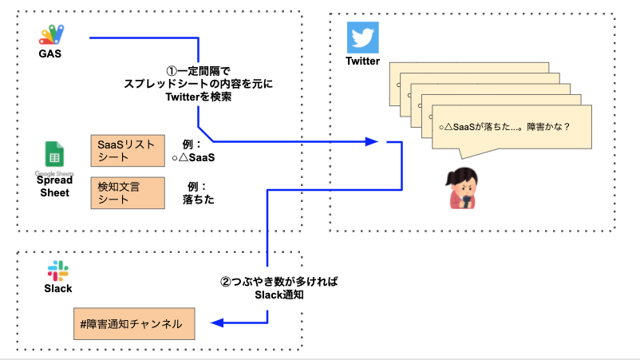
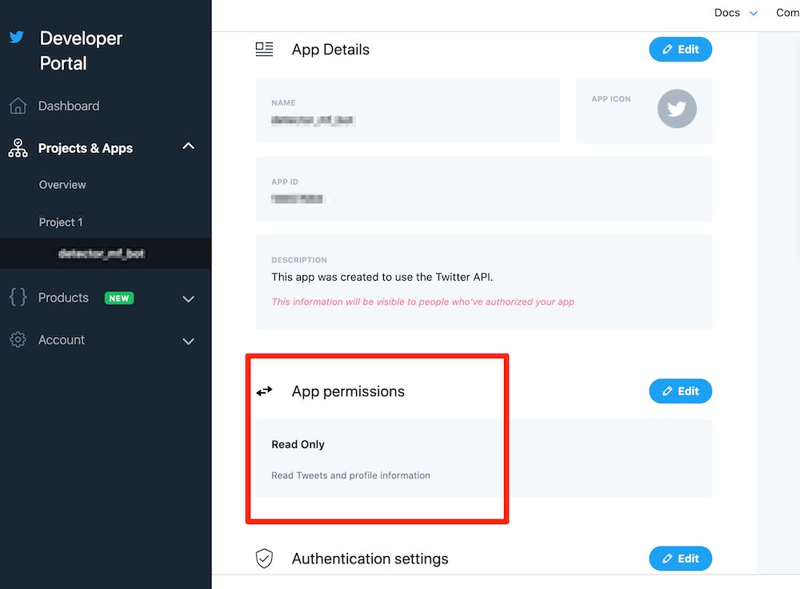
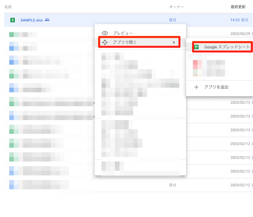
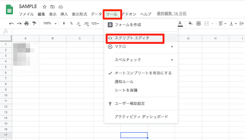
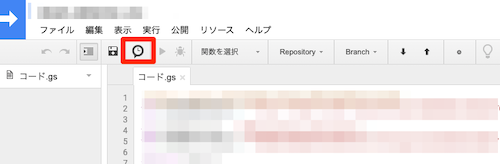
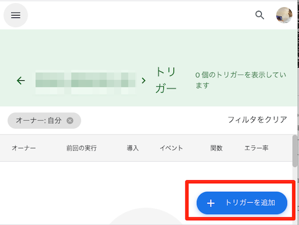
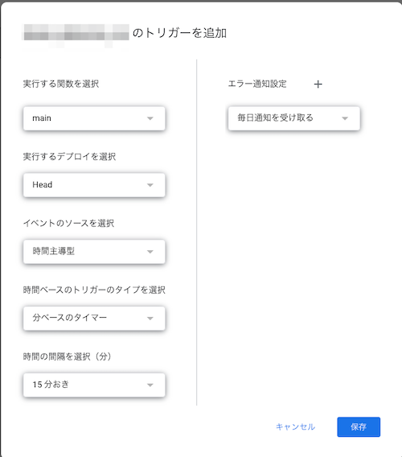

# このリポジトリは？

Twitterのつぶやきを監視して、SaaSの障害を検知する。  

SaaS検知用としてますが、エゴサ用にも使えるかも。

## 必要なもの

1. Googleアカウント(G Suiteはもちろん、無料アカウントでもOK)
2. Twitterアカウント
3. Slackアカウント(無料アカウントでもOK)

## 概要

下記のようにして、SaaSの障害を検知する。

1. スプレッドシートに障害検知したい「SaaS名」と「障害とみなすつぶやきのキーワード」を記載。
   - 例：
      - SaaS名： ○△SaaS
      - 障害キーワード ： 落ちた
2. Google Apps Scriptで上記1の文言をTwitter APIを利用してTwitterから検索する処理を定期実行する。
   - このスクリプトの内容では15分間隔で実行させてます。
3. 障害に該当するメッセージのつぶやき数が多い場合、Slackに通知。
   - 短時間に数件の障害つぶやきがあれば、障害とみなしてSlackに通知するようにしています。理由は下記の通りです。
      - 1-2件のつぶやきでは誤報の可能性が高いため。

- 構成のイメージ図
   - 

## 初期構築前の事前準備

1. Twitter APIの準備
   - 下記手順などを参考に、Twitterの「API Key」と「API key secret」を取得。
     - https://help.twitter.com/ja/rules-and-policies/twitter-api
     - https://qiita.com/nobu09/items/c940fc6e0d67ef1cbc85
     - https://qiita.com/kngsym2018/items/2524d21455aac111cdee
     - https://www.itti.jp/web-direction/how-to-apply-for-twitter-api/
     - 権限は「Read Only」だけ与えておけば十分です。
        - 
2. Slackチャンネル 及び そのチャンネルに対してのIncoming Webhook URLの準備
   - 下記手順などを参考にIncoming WebhookのURLを取得する
     - https://slack.com/intl/ja-jp/help/articles/115005265063-Slack-%E3%81%A7%E3%81%AE-Incoming-Webhook-%E3%81%AE%E5%88%A9%E7%94%A8
     - https://qiita.com/kshibata101/items/0e13c420080a993c5d16

## 初期構築手順

1. このリポジトリにある「SAMPLE.xlsx」をGoogleDriveにアップロード。
   - ※ファイル名はアップロード時に任意に変更頂いてOK。
2. 1のファイルをスプレッドシート形式に変換。
   - アップロード後に「アプリで開く」-「Google スプレッドシート」とすればOK。
      - 
3. スプレッドシートのスクリプトエディタを開く。
   - 「ツール」-「スクリプトエディタ」とすればOK。
      - 
4. スクリプトエディタに「sample_gas.gs」の内容をコピペ。
5. 2-5行目に事前準備で取得したキー情報を記載。
   - 2行目： 変数「slackWebhookUrl」にSlackのIncoming WebhookのURLを記載。
   - 4行目： 変数「twitter_api_key」にTwitterのAPI Keyを記載。
   - 5行目： 変数「twitter_api_key_secret」にTwitterのAPI Key secretを記載。
5. 15分おきにGASが実行されるようにトリガーを設定する。
   - 「時計アイコン?」を選択 - 「トリガーを追加」を選択 - 「main」ファンクションが「15分おき」に実行されるように設定。
      - 
      - 
      - 

## 運用手順

下記内容をスプレッドシートのそれぞれのシートに記載すれば監視が始まります。

1. 「SaaSリスト」シート
   - A列: 監視したいSaaS名
   - B列: Twitterに15分間の間に何件つぶやかれたらSlack通知するか、しきい値を記載。
2. 「検知文言」シート
   - A列： SaaSリストに記載された製品名と一緒に「何がつぶやかれたら」検知するかを記載。
      - 例： 障害、落ちた、等
      - 例： SaaSリストに「gmail」、検知文言に「落ちた」とした場合、「gmailが落ちたー」といったつぶやきを検知するようになります。
3. 「無視文言」シート
   - A列： つぶやきのうち無視する文言を記載。
   - 例： 「連番」を記載した場合、「gmailで限定Boxの発送通知が来ない。当選落ちたか...」といったつぶやきを無視します。

## 初期構築後のテスト方法

1. 「SaaSリスト」シートにA列に「テスト」、B列に「1」と記載。
2. 「検知文言」シートに「障害」と記載。
3. Twitterで「障害テスト」とつぶやく
4. 15分後にSlackに通知がくることを確認。